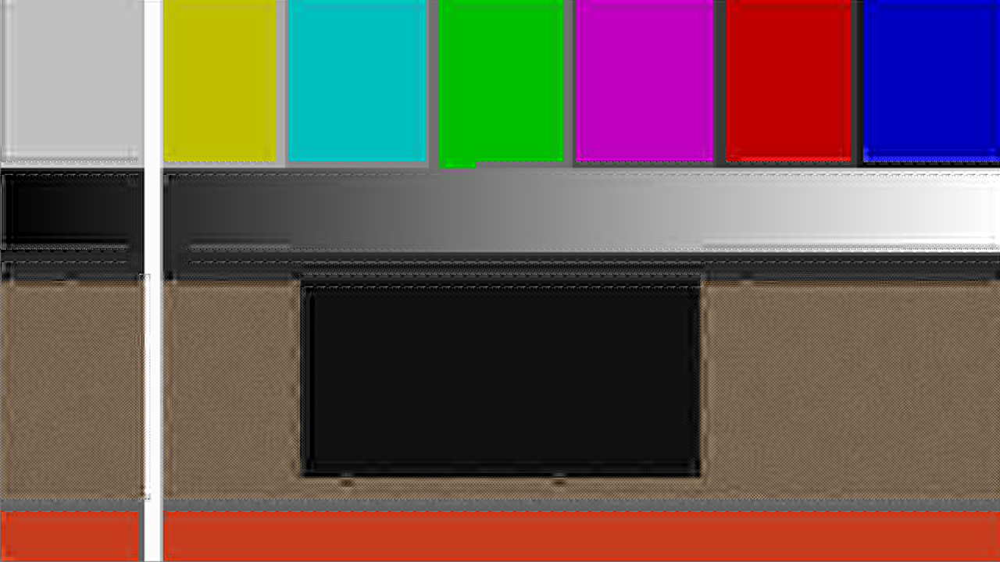
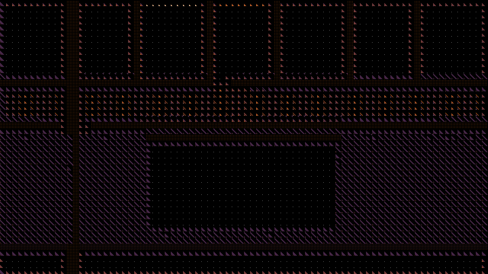
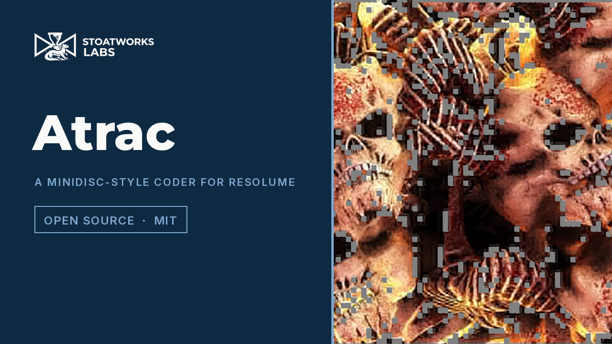

# atrac

> **AI-assisted project.** This codebase was created with [Claude](https://claude.com/claude-code)
> (Anthropic), directed and reviewed by a human author. The coder is not
> asserted but measured: an offline harness drives the real plugin class in a
> headless GL context and reads each claim back out of the picture it made or
> out of the allocation texture the plugin's own shader wrote — at unlimited
> bits the lapped transform returns the input within a rounding bound derived
> from the arithmetic, through long, short and mixed blocks; every block
> spends at most its budget and wastes less than one increment; a step's
> quantisation noise reaches exactly one block before the edge in Long mode
> and three eighths of a cell in Short; SNR rises with Bit Rate; a band
> beside a louder one is zeroed with Masking on and coded with it off; a
> knock breaks playback exactly when it outlasts the buffer and playback
> resumes on the closed form — with twelve negative controls that prove each
> check can fail. It has **never been loaded into Resolume**. It is loaded by
> [oxbow](https://github.com/stoatworks-labs/oxbow), which is a real FFGL host
> and is not Resolume. See [Status](#status).

MiniDisc's perceptual coder, run on the picture, as an FFGL effect for
[Resolume](https://resolume.com) Arena and Avenue.



<sub>One frame, rendered by `actest`, the offline harness — not captured from
Resolume. The defaults: 0.5 bits per pixel on 16-pixel blocks, adaptive
switching, a moderate masking model. The texture at the bottom has lost its
grain to the budget; the dark block's edges ring.</sub>

<!-- downloads:start -->

## Download

**[v0.1.0](https://github.com/stoatworks-labs/atrac/releases/tag/v0.1.0)** — prebuilt for macOS and Windows. Pick your platform:

<details>
<summary><b>macOS</b> — Universal (Apple Silicon + Intel)</summary>

| Build | Download | Size |
| --- | --- | --- |
| Universal (Apple Silicon + Intel) · .dmg disk image | [`atrac-0.1.0-macos-universal.dmg`](https://github.com/stoatworks-labs/atrac/releases/download/v0.1.0/atrac-0.1.0-macos-universal.dmg) | 234 KB |
| Universal (Apple Silicon + Intel) · .zip archive | [`atrac-macos-universal.zip`](https://github.com/stoatworks-labs/atrac/releases/latest/download/atrac-macos-universal.zip) | 193 KB |

</details>

<details>
<summary><b>Windows</b> — x64</summary>

| Build | Download | Size |
| --- | --- | --- |
| x64 · .exe installer | [`atrac-0.1.0-windows-x86_64-setup.exe`](https://github.com/stoatworks-labs/atrac/releases/download/v0.1.0/atrac-0.1.0-windows-x86_64-setup.exe) | 227 KB |
| x64 · .zip archive | [`atrac-windows-x86_64.zip`](https://github.com/stoatworks-labs/atrac/releases/latest/download/atrac-windows-x86_64.zip) | 121 KB |

</details>

All builds, checksums and release notes: [github.com/stoatworks-labs/atrac/releases](https://github.com/stoatworks-labs/atrac/releases).

macOS builds are signed and notarised and open normally. The Windows builds are unsigned, so SmartScreen warns once.

<!-- downloads:end -->

## The one idea

ATRAC does not throw detail away by resolution. It throws it away by **bits**.

The signal is cut into overlapping blocks. Each goes through an MDCT — the
lapped transform whose overlapping halves cancel each other's aliasing. The
coefficients are grouped into block floating units, each with a scale factor
and a word length. And **a fixed bit budget per block** — on MiniDisc, 212
bytes, always — is shared out by a masking model: a band next to a loud band is
masked and gets few bits or none.

Here the same coder runs on the picture, as a separable 2-D lapped transform
with a fixed budget per block. Every artefact is a consequence of that budget
and that transform, and none of it is drawn:

- **Fine texture goes first.** High bands in a busy block fall to the bottom of
  the queue and get zero bits. Flat blocks get more bits than they need and busy
  ones starve, because the budget is fixed.
- **Pre-echo.** Quantisation noise spreads over the whole window, so a hard
  edge rings for one block either side. ATRAC's answer is block switching: a
  transient selects short blocks. `Block Mode` shows the cure and what it costs.
- **The swirl.** The allocation changes from frame to frame, so a band's bits
  appear and vanish, and quantised texture shimmers at low rates.
- **The skip.** A MiniDisc reads the disc faster than it plays into a
  shock-proof buffer. A knock stops the read, the buffer drains, and only if it
  empties does playback break. An audio onset — or the `Knock` button — is the
  knock; when the buffer empties the picture holds until it has refilled.



<sub>Show Bits: each cell painted as its own coefficient plane, the word length
of every band as a heat map. The busy cells at the bottom spend their bits
across many bands; the flat bars at the top pour them into the first few.</sub>

## What falls out

- **Block switching is exact.** The overlap at every block boundary is the
  smaller of the two blocks meeting there, so a short block beside a long one
  reconstructs perfectly with no transition windows — the harness proves it
  through mixed long/short pictures to within 1% of a derived rounding bound.
- **A flat field is not one coefficient.** An MLT has no compact DC basis: a
  constant projects onto every band, the zig-zag BFU shares each axis
  coefficient with the block's interior, and the scale factor is the loud one's.
  So flat areas keep a faint block ripple until the rate is high. That is the
  transform, not a bug, and it is why the swirl is visible even where nothing
  moves.
- **Chroma is coded as Cb and Cr at a fraction of the luma budget**
  (`Chroma Bits`), like joint coding; at zero the picture goes grey.
- **The disc's arithmetic is exact.** Buffer, read speed and knock length are
  seconds and a multiplier in double on the CPU; a knock of L on a full buffer
  of B breaks playback iff L > B, at B after the knock, and playback resumes at
  L + (B/4)/r — the harness measures both out of the picture.

[](https://www.youtube.com/watch?v=AKqH_9a7YPo)

*[Watch it](https://www.youtube.com/watch?v=AKqH_9a7YPo) — 55 seconds:
texture starving and cells falling to grey as the rate drops, pre-echo on long
blocks and short blocks confining it, Block Size 8/16/32, Show Bits filling
outward as the budget grows, Chroma Bits to zero and back, a knock that the
buffer absorbs and one that empties it, and the disc skipping on the beat.
Every frame is the real plugin's output: an FFGL plugin has no window, so the
footage is rendered by this repository's own offline harness (`actest --pipe`,
driven by a cue sheet) rather than filmed off a screen, and the clips are
Resolume's bundled demo media.*

## Controls

| Group | |
| --- | --- |
| **Coder** | Bit Rate (0.05 to 4 bits per pixel), Block Size (8, 16, 32), Block Mode (Long, Short, Adaptive), Masking (the masked threshold from 60 dB below the neighbours' spread to level with it), Chroma Bits (each of Cb and Cr's share of the luma budget) |
| **Disc** | Buffer (0 to 10 s), Read Speed (1× to 4× the play rate), Sensitivity (the onset detector; 0 never knocks), Knock Length (50 ms to 5 s), Knock (the button), Audio (the spectrum) |
| **View** | Show Blocks (the cell grid, short cells tinted), Show Bits (word length per band, as a heat map), Mix |

Block Mode Adaptive picks short blocks where the energy of a cell's first
differences in one half is eight times the other's, along either axis, and
Show Blocks says which it chose.

## Status

**v0.1.0, and honestly early — 24 September 2026.**

### Measured offline, on macOS

`tools/verify.sh` passes on this machine (M4 Max, macOS 26.4.1) against a fresh
universal Release build, running every rendered check at **two rasters**,
320×180 and 1280×720; the same checks also pass at 333×187. What it
establishes:

| check | result |
| --- | --- |
| `--tdac` | at unlimited bits, N = 8, 16 and 32 in Long, Short and Adaptive (with both kinds of cell present): l2 error 3.4e-5 to 4.2e-5 against derived bounds of 4.7e-3 to 1.5e-2 at 320×180, up to 1.7e-4 against 6.0e-2 at 1280×720 (0.3% of the bound at both), worst pixel 7.7e-7 |
| `--budget` | 2,760 / 720 / 180 cell-channels at N = 8 / 16 / 32, three rates each: none over budget, none with a whole increment left (worst 0.75 of one), no band below the absolute floor coded, every scale factor the smallest not below its peak (20,908 checked at N = 8), and every cell identical to the stated greedy |
| `--preecho` | a step's noise reaches exactly N pixels before the edge in Long (8, 16, 32), 0 / 2 / 12 in Short and in Adaptive against bounds of 3N/8; Adaptive picks short at the edge cells and long beside them |
| `--snr` | 19.4, 21.5, 23.4, 26.5, 28.8, 35.6 dB at 0.1 to 3.2 bits per pixel: strictly rising, smallest step per doubling 1.9 dB |
| `--masking` | two basis functions planted in one block, 24 dB apart, read back as planted; on 48 bits the weak band gets 0 with Masking on (the strong one 12) and 2 with it off (the strong one 6) — the allocation the statement predicted |
| `--skip` | B = 0.5 s, r = 2, L = 1 s: frames 42–74 held against a closed form of 43 and 74.75; r = 4: 42–72 against 43 and 72.88; L = 0.25 s: nothing held |
| `--resize` | 320×180 → 480×270 mid-mute: still muted, the held picture's mean unchanged to 4 decimals (bound 0.0087), playback resumes on the closed form |
| `--offline` | the BFU rule, the scale-factor law, the ramps and basis exact; the stated transform reconstructs through long/short mixtures to 8.5e-15 in double; the disc's arithmetic within one frame of the closed form in nine cases; no knock on the first frame of a loud clip, from an origin of 0 s or 40 s |
| `--negative` | twelve perturbed models — a rectangular window, a budget of 5/4, a greedy that stops early, short blocks that are really long, Bit Rate ignored, masking ignored, a knock that empties the buffer at once, a refill at 1×, a resize that clears the held picture, an unprimed detector — each **fails** its check |
| mutation | one character of the shipped GLSL (`p = n - M / 2` → `M / 3` in the window) was caught by `--tdac` in all nine combinations and by `--masking`, then reverted |
| `tools/sweep.py` | all **13** controls measurably change the picture |
| shaders | all 10, as the plugin compiles them, through `glslc` |
| `--pipe` | 2.5 frames in, exactly 2 out; an unknown cue refused (2); a failed render and a closed stdout each exit 1 |
| the bundle | universal (`x86_64 arm64`), exports `plugMain`, ad-hoc signs; `oxbow` reports `SW Atrac` / `AC01` / `effect` and renders 120 frames through `plugMain` |

Render cost, best of three runs of 60 frames after a warm-up, `glFinish` both
sides, on a GPU shared with other builds: **3.2 ms** at 720p, **4.9 ms** at
1080p, **16.1 ms** at 4K with the default 16-pixel blocks (1.4 / 3.0 / 10.0 ms
at 8, 7.2 / 15.1 / 30.4 ms at 32). Each pixel costs 2N taps in each of four
lapped passes; at 4K on 16-pixel blocks that is a whole 60 fps frame, and
nothing has been optimised yet. macOS figures only.

### Not established

It has **never been loaded into Resolume**. Everything above was compiled,
rendered and measured offline against the real plugin class in a headless CGL
context, plus an `oxbow` load. How it looks on footage, how fourteen controls
read in Arena's inspector, and what Resolume's 64 FFT bins actually carry — the
onset detector sums flux over every bin so it does not care how they are laid
out in frequency, but whether they are magnitudes or powers is unmeasured and
the square root of each is an assumption inherited from the fleet — are
untested. The masking model's slopes and offset are stated, not tuned against
anything. On Windows it has been loaded: a build of this source loads, registers and renders in Resolume Arena 7.27.1 on software rendering (win-lab, Mesa llvmpipe, no GPU), with all 20 host controls as declared and 9 of them shown moving the picture; Buffer, Read Speed and Knock Length could not be shown there, because they act only during a knock and the gate never presses the button, and the two audio controls were skipped because that machine has no sound device. The first build failed there: `packed` is a reserved word in GLSL 4.10 and the alloc shader would not compile on Mesa, which nothing on this Mac had caught. No OpenFX port and no presets. There is a
[user guide](https://stoatworks-labs.com/software/atrac/guide/) and a
[browser demo](https://atrac-demo.stoatworks-labs.com), which is a port to a
web page rather than the plugin: the shaders run in WebGL2 and the tables, the
disc and the clock are rewritten in JavaScript; it has no audio, and it says so.

## Build

Needs CMake 3.15+, a C++17 compiler, and the FFGL SDK submodule.

```bash
git clone --recursive https://github.com/stoatworks-labs/atrac
cd atrac
cmake -B build -DCMAKE_BUILD_TYPE=Release
cmake --build build --parallel
cmake --install build     # into ~/Documents/Resolume Arena/Extra Effects
```

macOS builds are universal (Apple Silicon + Intel) by default; add
`-DCMAKE_OSX_ARCHITECTURES=arm64` for a faster dev build. Windows needs GLEW via vcpkg.

## Building and testing

The offline harness renders the real plugin class headlessly, on a synthetic
60 fps clock:

```bash
./build/actest --out /tmp/frame.png --size 1920x1080   # the moving card
./build/actest --list                                  # every control, kind and default
./build/actest --tdac --budget --preecho --snr         # each claim, measured
./build/actest --masking --skip --resize
./build/actest --negative                              # and the checks can fail
./build/actest --offline                               # what needs no GL (CI)
./build/actest --bench                                 # 720p, 1080p and 4K
python3 tools/sweep.py                                 # no control is silently dead
tools/verify.sh                                        # all of it, on a fresh universal build
```

Every check takes `--size`; run it at 320×180 as well as the raster you care about.
Footage goes through the real shaders with `--pipe`, in the fleet's frame format:

```bash
ffmpeg -i in.mov -f rawvideo -pix_fmt rgba - \
  | ./build/actest --pipe --size 1920x1080 --fps 50 --script cues.txt \
  | ffmpeg -f rawvideo -pix_fmt rgba -s 1920x1080 -r 50 -i - out.mov
```

See [`CLAUDE.md`](CLAUDE.md) for the full command reference and
[`AGENTS.md`](AGENTS.md) for the model and the traps.

<!-- attributions:start -->
This project is built on other people's work — see [ATTRIBUTIONS.md](ATTRIBUTIONS.md).
<!-- attributions:end -->

## Licence

MIT — see [LICENSE](LICENSE).
